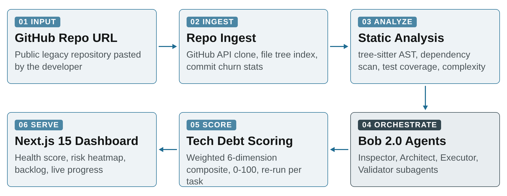

# RepoRevive — Legacy Code, Revived.

> IBM Bob 2.0 Hackathon submission · lablab.ai · September 2026
> AI-guided health audit and renovation for legacy repositories — a multi-agent pipeline that scores, plans, and fixes real code.

Paste a GitHub URL and RepoRevive runs three orchestrated phases on your repository — **Audit → Plan → Renovate** — while a transparent 0–100 health score climbs live on the dashboard.

> **Live demo:** https://reporevive-sable.vercel.app — click **Run RepoRevive** and watch the full Audit → Plan → Renovate pipeline execute in ~13 seconds: live agent console, CVE lookups, health scoring (42 → 89), findings, renovation plan and before/after diffs.

## The problem

Most of the world's software is legacy: outdated dependencies, hidden CVEs, near-zero test coverage, and architecture that lives only in the heads of developers who left. Static-analysis tools flood teams with warnings — they can't prioritize, can't explain, and can't fix anything. Onboarding takes weeks; refactoring is a gamble because nobody knows which files are safe to touch.

## The solution — three orchestrated phases

| Phase | Agent | What happens |
|-------|-------|--------------|
| **1 · Audit** | Inspector | Tree-sitter AST parsing, dependency scanning, coverage & complexity metrics, documentation checks → 0–100 health score, auto-generated architecture diagram, risk heatmap (churn × complexity × test gap) |
| **2 · Plan** | Architect | Audit JSON → prioritized, dependency-ordered backlog; every task carries rationale, affected files, acceptance criteria, and score-point ROI |
| **3 · Renovate** | Executor + Validator | Tasks executed one at a time with builds/tests run through the shell; every diff reviewed before commit; health score recomputed after each merge |

## Scoring model

Six weighted dimensions drive the health score:

`Test coverage 25% · Dependency freshness 20% · Code complexity 20% · Documentation 15% · Type safety 10% · CVEs 10%`

## Architecture

Six-stage pipeline — **Input → Ingest → Analyze → Orchestrate → Score → Serve** — with IBM Bob 2.0 at the hub coordinating Inspector, Architect, Executor and Validator subagents.



## How we use IBM Bob 2.0

Bob 2.0 is the orchestration core of RepoRevive — not a bolted-on chat feature. Five specific integration points:

1. **Full-repo audit (Inspector).** Bob runs in Agent mode pointed at the cloned repository: it navigates the file tree, reads source files, READMEs, CI configs and lockfiles using its document-understanding capability, and reasons over the entire codebase instead of isolated snippets. It returns structured findings as a machine-readable JSON report that feeds our scoring engine.
2. **Parallel analysis via subagents.** A single Bob session spawns parallel subagents: one sweeps dependency manifests, one computes AST-based complexity metrics, one audits tests and documentation. Bob merges their outputs into a single health report using its parallel-task orchestration.
3. **Renovation planning (Architect).** Bob consumes the audit JSON and generates a dependency-ordered, prioritized task backlog where every task carries rationale, affected files and acceptance criteria.
4. **Guided renovation (Executor + Validator).** For each task, Bob edits the code, runs builds and tests through its shell access, checks acceptance criteria and updates task status. A separate Validator pass reviews each diff before it is committed, and the 0–100 health score is recomputed after every merged task.
5. **Team development workflow.** Every team member ran Bob sessions throughout the hackathon — scaffolding the dashboard, building the scoring engine, debugging the ingestion pipeline, and reviewing the final codebase (per-member session screenshots in [`team/`](team/)).

watsonx.ai / watsonx Orchestrate: not used in this build — all reasoning and agent orchestration run on IBM Bob 2.0.

## Media

| Asset | Path |
|-------|------|
| **Live demo app** | **https://reporevive-sable.vercel.app** (hosted on Vercel) |
| Cover image (16:9) | [`media/cover/RepoRevive_Cover_16x9.png`](media/cover/RepoRevive_Cover_16x9.png) |
| Pitch deck (12 slides, PDF) | [`media/deck/RepoRevive_Pitch_Deck.pdf`](media/deck/RepoRevive_Pitch_Deck.pdf) |
| Video presentation (2:51, 1080p) | [`media/video/RepoRevive_Video_Presentation.mp4`](media/video/RepoRevive_Video_Presentation.mp4) |
| Video narration script & splice guide | [`docs/video-narration-script.md`](docs/video-narration-script.md) |
| Slide design sources (HTML) | [`slides/`](slides/) |

## Tech stack

Next.js 15 · TypeScript · React · Tailwind CSS · Node.js · GitHub REST API · tree-sitter · D3.js/SVG · **IBM Bob 2.0** (Agent Mode, Subagents, Parallel Tasks, Full-Repo Context, Document Understanding)

## Repository layout

```
├── README.md                  ← you are here
├── .bobignore                 ← credential & artifact exclusions
├── media/                     ← submission media (cover / deck / video)
├── docs/                      ← Bob usage statement, video script
├── slides/                    ← pitch deck HTML sources + rendered PNGs
└── team/                      ← per-member Bob session screenshots
```

## Team RepoRevive

Four builders, forty-eight hours. Bob session screenshots from every member are collected in [`team/`](team/) as required by the submission rules.
